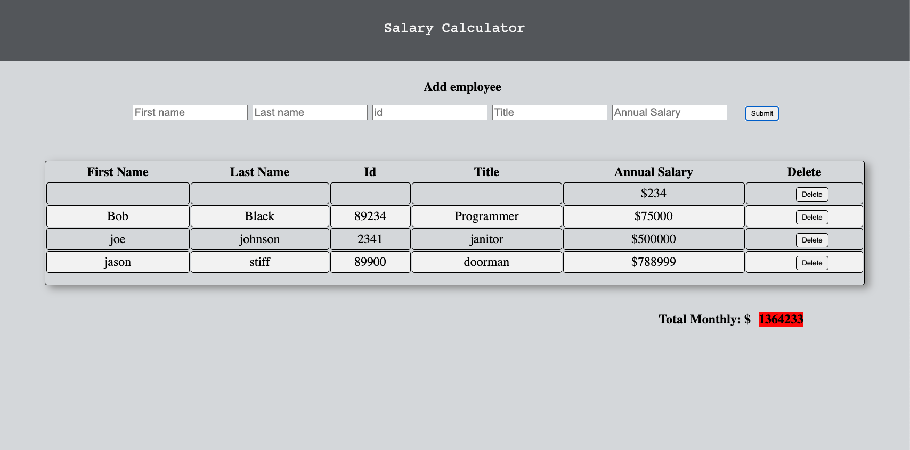

# Project Name

[Project Instructions](./INSTRUCTIONS.md), this line may be removed once you have updated the README.md

## Description

# PROJECT NAME

jquery-salary-calculator

## Description

_Duration: Weekend project_

Application for recording employee information and calculating that employees monthly salary. App uses DOM manipulation to mock database functionality.

To see the fully functional site, please visit: [DEPLOYED VERSION OF APP](www.heroku.com)

## Screen Shot

### Prerequisites

Link to software that is required to install the app (e.g. node).

- [Node.js](https://nodejs.org/en/)
- HTML
- CSS

## Installation

This application will run from the Browser. There is no need to install third party code.

## Usage

How does someone use this application? Tell a user story here.

1. Fill out the input fields for each employee.
2. Submit employee infomation which will be stored in database.
3. Total monthly cost of the company will be displayed at the bottom.
4. If Total monthly cost exceeds \$20,000 the cost field will turn red.

## Built With

List technologies and frameworks here

## License

[MIT](https://choosealicense.com/licenses/mit/)

_Note, include this only if you have a license file. GitHub will generate one for you if you want!_

## Acknowledgement

Thanks to [Prime Digital Academy](www.primeacademy.io) who equipped and helped me to make this application a reality. (Thank your people)

## Support

If you have suggestions or issues, please email me at [youremail@whatever.com](www.google.com)
